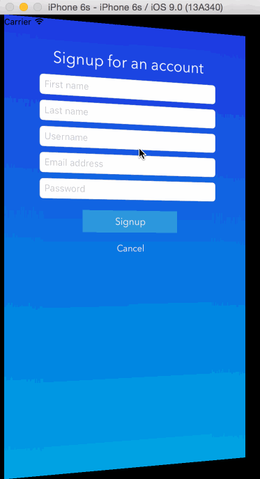

# StoryTeller
## Description
A fully immersive, mobile story application that redefines your adventures. Utilizing Magnet message as a location-based subscription feed, StoryTeller pulls up audio that is connected with particular places around the world. Travel to new locations, listen to narratives, and experience new areas like never before.

Alcatraz, a great example of a Bay Area tourist spot. Since its public opening in 1973, tours have been guided using old aged audio recorders. With StoryTeller, the experience is completely redefined.

Simply take out your smartphone, open the app, and you’ll be presented with streams of media based on where you are on the island. The closer you are to a story point, the higher up on the nearest stories it will appear.

The experience isn’t complete without adding your own new stories around the globe. Simply record your story at a particular location and have it available for all others who come seeking an adventure.

A fully immersive, mobile story application to redefine your adventures. StoryTeller.

## Installation
* Clone the repository from github and open it up in xcode

## Views Overview
### Signup / Login View
Open the app and you’ll be presented with the sign up / login view. If you’ve never used StoryTeller before, click sign up and enter basic information to get started. Else, put in your username and password to log in.

### StoryTeller View
After logging in, you’ll be presented with the main navigation view. The default tab is set to be the nearby tab. The nearby tab has a map on top which shows the closest storypoints and a tableview of these storypoints below. They are only unlocked and clickable if you are <= 100 meters and they are visible up to 10,000 meters. This encourages users to get out and explore storypoints to see and contribute to them. From here, you can add storypoints or click into existing ones by touching them on the table.
If you click on the + (plus) to add a storypoint, you’ll be presented with a new view that shows a screenshot and asks for the name and tags to describe it. After entering the information and hitting enter, the previous view will appear with the new storypoint appearing on the map.
Clicking on an unlocked storypoint will then open up the Messages View

### Messages View
The messages view is the list of all stories for a particular storypoint. Each story has a title along with the user and the time it was submitted. You can add new stories by clicking “Leave Message” and following the views on screen. You can also listen to stories by clicking on one of them.

### Map View
The tab next to nearby is the map tab. This allows users to see all storypoints around the globe and encourage them to get out and explore.

### Profile View
The tab next to map is the profile tab. Currently it displays a very basic profile of the user’s name and email address. At the top right hand corner we added a demo option to allow those testing our app to see what it would look like when fully in use.

### Profile View -> Settings -> Demo Knobs
As a demo, you can throw down some nearby storypoints with ease in order to experience nearby locked and unlocked storypoints.

App Demo:

GIF created with [LiceCap](http://www.cockos.com/licecap/).
